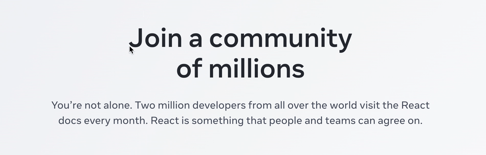

# Less Translate

It is an instant-aware Chrome translation extension that can do translate simply by moving the mouse in.

## How to use
1. Clone this repository.
2. Go to `chrome://extensions` in your browser, toggle on the `Developer mode` switch. Then click on `Load unpacked` and select the repository folder.